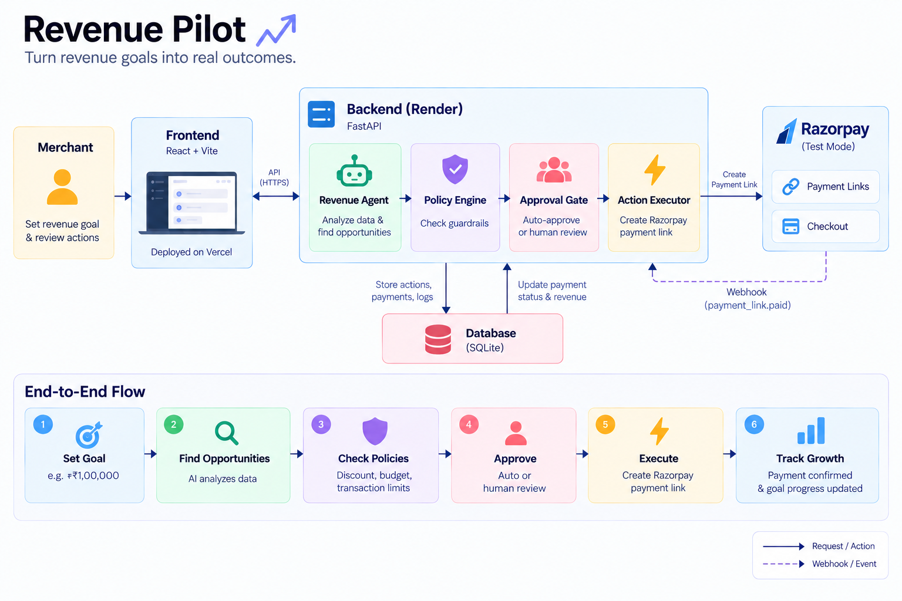

# Revenue Pilot — Architecture

Revenue Pilot converts a merchant revenue goal into a controlled revenue action and tracks the outcome.



## 1. Architecture

```text
Merchant
   │
   ▼
React + Vite Frontend
(Vercel)
   │ HTTPS / REST API
   ▼
FastAPI Backend
(Render)
   │
   ├── Revenue Analysis
   │      └── Customer + product + transaction analysis
   │
   ├── Opportunity Engine
   │      └── Churn / Cross-sell / Upsell / Replenishment
   │
   ├── Policy Engine
   │      └── Discount / budget / transaction limits
   │
   ├── Approval Gate
   │      └── Auto-approved or merchant approval
   │
   ├── Action Executor
   │      └── Razorpay Payment Link creation
   │
   └── Webhook Receiver
          └── Payment event processing
   │
   ├──────────────► SQLite
   │                State + audit data
   │
   └──────────────► Razorpay Test Mode
                    Payment Links + Checkout
```

## 2. End-to-End Flow

```text
Set Goal
   ↓
Analyze Data
   ↓
Find Opportunities
   ↓
Create Action Proposal
   ↓
Check Merchant Policy
   ↓
Auto-Approve OR Merchant Approval
   ↓
Execute Approved Action
   ↓
Create Razorpay Payment Link
   ↓
Payment Outcome / Webhook
   ↓
Update Payment + Revenue + Goal Progress
   ↓
Audit Trail
```

## 3. Core Components

### Frontend
- React + Vite
- Merchant dashboard
- Calls backend REST APIs
- Does not directly execute money actions

### Backend
- Python + FastAPI
- Business logic and orchestration
- Exposes REST API endpoints
- Enforces action and approval rules

### Revenue Analysis
- Uses customer, product and transaction data
- Calculates revenue-growth opportunities
- Current opportunity analysis is deterministic

### Opportunity Engine
Generates:
- VIP churn win-back
- Cross-sell
- VIP upsell
- Replenishment

Each opportunity includes a proposed offer, projected revenue and ROI.

### Policy Engine
Checks proposed actions against merchant guardrails.

Current configured limits:
- Maximum autonomous discount: **10%**
- Maximum campaign budget: **₹20,000**
- Maximum autonomous transaction: **₹5,000**
- Refunds: **Disabled**
- Human approval above the discount limit: **Enabled**

A policy violation blocks autonomous execution and can produce a compliant alternative.

### Approval Gate

```text
Policy Passed
   ├── Within autonomous limits → Auto-approved
   └── Outside limits → Merchant approval required
```

Execution happens only after the backend accepts the required approval state.

### Action Executor
- Uses the Razorpay Payment Links API
- Creates Razorpay Test Mode Payment Links
- Associates the link with the Revenue Pilot action

### Database
SQLite stores application state including:
- Customers
- Products
- Orders / transaction data
- Revenue goals
- Opportunities
- Action proposals
- Payment information
- Audit events
- Merchant policy

### Webhook Receiver
Endpoint:

```text
POST /api/webhooks/razorpay
```

The receiver:
1. Reads the raw webhook body
2. Validates the Razorpay signature when configured
3. Handles Payment Link payment events
4. Matches the event to the Revenue Pilot action
5. Records the payment outcome
6. Updates application state and audit data

Configured primary event:

```text
payment_link.paid
```

## 4. Explainability & Audit

Revenue Pilot records the important stages of an action:

```text
Opportunity
   ↓
Policy Check
   ↓
Approval
   ↓
Razorpay Action
   ↓
Payment
   ↓
Revenue Update
```

The audit trail captures the decision, policy result, execution result and payment outcome.

## 5. Failure Handling

A failed Razorpay execution does not create a fake payment.

```text
Approved Action
      ↓
Execution Failure
      ↓
No Payment Link
      ↓
Failure Recorded
      ↓
Action Remains Recoverable
```

Revenue Pilot also includes a demo recovery protocol that selects a compliant revenue opportunity and sends it through the existing approval and execution flow.

## 6. Deployment

```text
Vercel
React + Vite
    │
    │ HTTPS
    ▼
Render
FastAPI
    │
    ├── SQLite
    │
    └── Razorpay Test Mode
             │
             └── Webhook → FastAPI
```

Environment secrets such as Razorpay API credentials and the webhook secret are supplied through environment variables.

## 7. Design Principle

**The agent proposes.  
The policy engine bounds.  
The approval gate controls.  
Razorpay executes.  
The audit trail records.**
